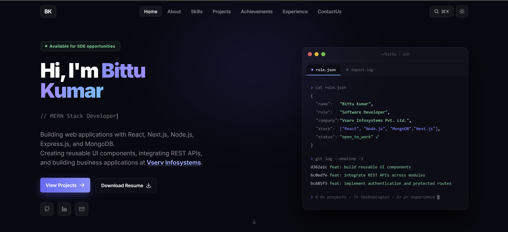
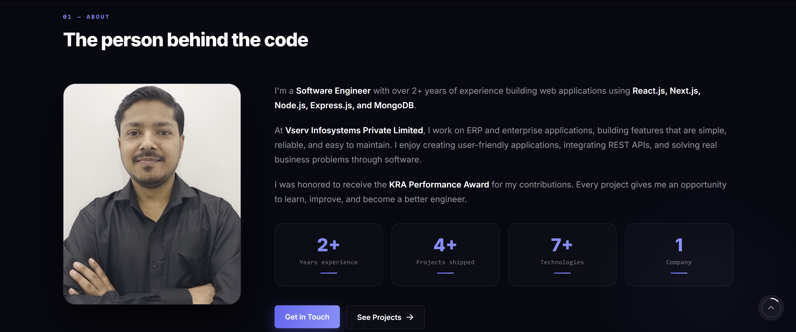

<div align="center">



<br/>
<br/>

# Bittu Kumar

### Full-Stack Developer · MERN · React

A hand-built portfolio for shipped work — full-stack systems in production,<br/>
documented down to their flow, ER, and schema diagrams.

<br/>

[](https://personalportfolio-web-app.onrender.com/)
&nbsp;
[](./public/Bittu_Kumar_Resume.pdf)
&nbsp;
[](https://www.linkedin.com/in/bittu-kumar143/)
&nbsp;
[](https://github.com/Bittu121)

<br/>


</div>

<br/>

---

<br/>

<div align="center">

|  **2+**  |  **4+**  |  **7+**  |  **3**  |
| :------: | :------: | :------: | :-----: |
| Years experience | Projects shipped | Technologies | Full-stack case studies |

</div>

<br/>

---

<br/>

## Overview

This portfolio is less a résumé page and more a **case-study site**. Each project ships with real screenshots, a feature breakdown, and its architecture — flow diagram, ER diagram, and database schema — presented in-page through modals rather than linked away.

Built with React 18 and Tailwind, animated with Framer Motion, and organized so every section's copy lives in its own `*Data.js` file — content stays separate from presentation.

<br/>

## Highlights

<table>
<tr>
<td width="50%" valign="top">

### ⌘K Command Palette
A keyboard-driven navigation modal with arrow-key traversal — jump to any section without touching the mouse.

</td>
<td width="50%" valign="top">

### Terminal Hero
An animated terminal mock rendering a `git log` and a live `impact.log`, with cycling role taglines.

</td>
</tr>
<tr>
<td width="50%" valign="top">

### Architecture Modals
Every project exposes its **Flow**, **ER**, and **Schema** diagrams in a tabbed viewer.

</td>
<td width="50%" valign="top">

### Project Carousel
Full screenshot walkthroughs — up to 13 captured screens per project.

</td>
</tr>
<tr>
<td width="50%" valign="top">

### Motion & Polish
Framer Motion fade-ins, a loading state, scroll-to-top, and smooth scroll-spy navigation.

</td>
<td width="50%" valign="top">

### Fully Responsive
Mobile-first Tailwind layout with toast-backed contact form feedback.

</td>
</tr>
</table>

<br/>

---

<br/>

## Featured Projects

<table>
<tr>
<td width="60" align="center"><b>01</b></td>
<td>

### Asset Management System &nbsp;·&nbsp; `Full-Stack`

Complete IT asset lifecycle platform — QR tagging, allocation, gate passes, and reporting. Role-based access across Admin, Manager, Technician, and User, with JWT + refresh tokens, OTP password reset, Excel import/export, and full audit trails.

`Next.js` `TypeScript` `Node.js` `Express` `MongoDB` `Redux Thunk` `Tailwind`

[**Live Demo →**](https://asset-management-1-619b.onrender.com) &nbsp;·&nbsp; [Source Code](https://github.com/Bittu121/asset-management)

</td>
</tr>
<tr>
<td width="60" align="center"><b>02</b></td>
<td>

### Travel Desk Management System &nbsp;·&nbsp; `Full-Stack`

One platform for employees, managers, HR, vendors, finance, and admins. Two-step approval workflow with automated email hand-offs (manager → HR → vendor), vendor ticket uploads, payment tracking, and one-click Excel export.

`React` `Node.js` `Express` `MongoDB` `Redux` `Tailwind`

[**Live Demo →**](https://travel-desk-1.onrender.com) &nbsp;·&nbsp; [Source Code](https://github.com/Bittu121/Travel-Desk)

</td>
</tr>
<tr>
<td width="60" align="center"><b>03</b></td>
<td>

### Q Eats — Food Delivery Platform &nbsp;·&nbsp; `Full-Stack`

A Swiggy-style delivery app with real-time cart, category filtering, order tracking, Stripe payments with verification, and a separate admin panel for menu and order management.

`React` `Node.js` `Express` `MongoDB` `Stripe` `Tailwind`

[**Live Demo →**](https://fooddeliveryapp-frontend-zn5z.onrender.com) &nbsp;·&nbsp; [Source Code](https://github.com/Bittu121/FoodDeliveryApp/tree/main/client)

</td>
</tr>
</table>

<br/>

---

<br/>

## Tech Stack

<table>
<tr>
<td valign="top" width="25%">

**Frontend & Web**

React · Next.js<br/>
Tailwind CSS<br/>
JavaScript<br/>
HTML5 · CSS3<br/>
Redux

</td>
<td valign="top" width="25%">

**Backend & APIs**

Node.js<br/>
Express.js<br/>
REST APIs<br/>
JWT Auth<br/>
Zod · Middleware

</td>
<td valign="top" width="25%">

**Languages & CS**

C++ · JavaScript<br/>
OOPs · DSA<br/>
System Design<br/>
DBMS

</td>
<td valign="top" width="25%">

**Databases & Tools**

MongoDB · MySQL<br/>
Git & GitHub<br/>
Postman<br/>
VS Code · npm

</td>
</tr>
</table>

<br/>

---

<br/>

## Preview

<div align="center">



<sub><i>The About section — profile card, bio, and stat grid.</i></sub>

</div>

<br/>

---

<br/>

## Getting Started

**Requirements:** Node.js 16+ and npm

```bash
# 1 — Clone the repository
git clone https://github.com/Bittu121/personalPortfolio.git
cd personalPortfolio

# 2 — Install dependencies
npm install

# 3 — Start the dev server → http://localhost:3000
npm run dev
```

<br/>

### Scripts

| Command | Description |
| :------ | :---------- |
| `npm run dev` | Start the development server with hot reload |
| `npm run build` | Produce an optimized production build in `build/` |
| `npm test` | Run the test suite in watch mode |

<br/>

---

<br/>

## Project Structure

```
src/
├── components/
│   ├── navbar/        Navbar + ⌘K CommandPalette
│   ├── hero/          HeroSection + animated TerminalMock
│   ├── about/         ProfileCard · AboutBio · AboutStats
│   ├── skill/         Grouped skill cards
│   ├── project/       Showcase · Carousel · Features & Architecture modals
│   ├── achievements/  Awards and recognition
│   ├── experience/    Timeline of roles and education
│   ├── contact/       Contact form + info cards
│   ├── footer/
│   ├── FadeIn.jsx     Framer Motion scroll reveal
│   ├── Loading.jsx
│   └── ScrollToTop.jsx
├── data/
│   └── contactInfo.js Shared email, socials, scroll config
└── images/            Project screenshots and diagrams
```

> **Content lives beside its component.** Each folder pairs a `*Data.js` file with its UI, so updating copy never means touching JSX.

<br/>

---

<br/>

## Experience

| Role | Organization | Period |
| :--- | :----------- | :----- |
| **Software Developer** | VServ Infosystems Pvt. Ltd. | Jan 2025 — Present |
| **MERN Stack Intern** | Applore Technologies | May 2024 — Nov 2024 |
| **Frontend Developer Intern** | Can Technologies | Jan 2024 — Apr 2024 |
| **Software Engineer** | Share India Securities Ltd. | Jul 2022 — Apr 2023 |

**Education** — B.Tech, Computer Science & Engineering · Darbhanga College of Engineering · CGPA 8.5/10

<br/>

### Recognition

🏆 **KRA Performance Award** — for outstanding performance and project contributions at VServ Infosystems<br/>
🎯 **Category Rank 800** — BCECE 2017<br/>
🤝 **Techfest Hackathon Coordination** — Gyanki Techfest, college

<br/>

---

<br/>

<div align="center">

## Get in Touch

Open to **SDE · Frontend · Full-Stack** roles.

[](mailto:bittukumar8713@gmail.com)
&nbsp;
[](https://www.linkedin.com/in/bittu-kumar143/)

<br/>

<sub>Designed and built by <b>Bittu Kumar</b> · React · Tailwind CSS · Framer Motion</sub>

<br/>

<sub>⭐ If you find this portfolio useful, consider starring the repo.</sub>

</div>
